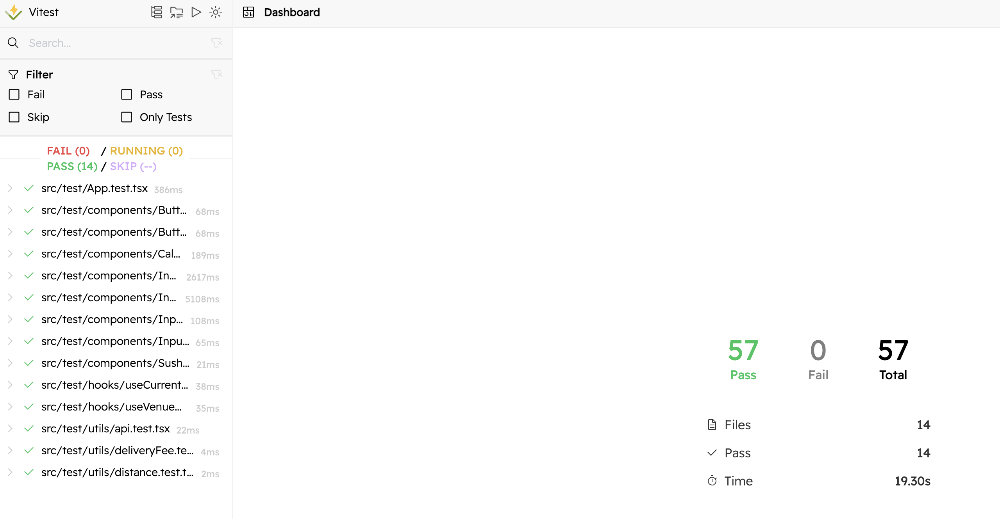

# Wolt 2025 Frontend Engineering Internship Assignment

## About the Project 💻

This project is a solution for the **Wolt 2025 Frontend Engineering Internship [Assignment](https://github.com/woltapp/frontend-internship-2025/tree/main)**. It implements a **Delivery Order Price Calculator** that calculates delivery fees, surcharges, and total prices based on user input and [Static](https://consumer-api.development.dev.woltapi.com/home-assignment-api/v1/venues/home-assignment-venue-helsinki/static) and [Dynamic](https://consumer-api.development.dev.woltapi.com/home-assignment-api/v1/venues/home-assignment-venue-helsinki/dynamic) API data.


The application was built using mainly **Vite** + **React** and **TypeScript**

Continuous Integration is enabled by **Github Actions**.
Location (latitude and long to latitude and longitude) calculations are calculated with **Harvesine formula**.

---

## Features ✨

- **Dynamic Delivery Price Calculation**: Calculates prices based on venue, user location, and cart value.
- **Input Validation**: Ensures all fields are valid with error messages for invalid input.
- **API Integration**: Fetches venue data dynamically from the provided [Static](https://consumer-api.development.dev.woltapi.com/home-assignment-api/v1/venues/home-assignment-venue-helsinki/static) and [Dynamic](https://consumer-api.development.dev.woltapi.com/home-assignment-api/v1/venues/home-assignment-venue-helsinki/dynamic) API data.
- **Responsive Design**: Built for having a good responsiveness on both desktop and mobile devices.
- **Testing & Coverage**: Includes unit tests and code coverage using **Vitest**, **React Testing Library** and **CodeCov** to visualize coverages.
- **Accessibility**: Ensures accessible interactions for a wide range of users like **VoiceOver** and **Tab control**.

---

## Libraries and Tools Used 📚

### **Core Libraries**

- [**React**](https://react.dev/learn): For building the user interface.
- [**Vite**](https://vite.dev/guide/): For building setup
- [**TypeScript**](https://www.typescriptlang.org/docs/): For static type checking and improved code quality.

### **Utilities**

- [**Axios**](https://www.npmjs.com/package/axios): For making API requests.
- [**Zustand**](https://www.npmjs.com/package/zustand): For state management.

### **Styling and Animations**

- [**TailwindCSS**](https://tailwindcss.com/docs/installation): Utility-first CSS framework for styling.
- [**React Lottie**](https://lottiereact.com/): For fun React logo animation.

### **Testing**

- [**Vitest**](https://vitest.dev/guide/): For running unit tests and coverage.
- [**Vitest UI**](https://vitest.dev/guide/ui): For visualizing test results.
- [**React Testing Library**](https://www.npmjs.com/package/@testing-library/react): For testing React components.

---

## Setup & Usage 🚀

### **Prerequisites**

- Node.js 23.4.0 (or 16+)
- npm (for dependency management)

### **Steps to Run the Project**

#### In deveoper state

1. Install the dependencies:
   ```bash
   npm install

   ```
2. Run the code:
   ```bash
   npm run dev
   ```
3. Server will be available at:
   ```bash
   http://localhost:5173

   ```

#### If you want to build and preview the project

1. Build the project:
   ```bash
   npm run build
   ```
2. Preview the build:
   ```bash
   npm run preview
   ```
3. Server will be available at:
   ```bash
   http://localhost:4173

   ```

---

## Testing 🧪

The project includes unit tests and react component testing

**Run Tests**

```bash
npm run test
```

**Run Coverage**

```bash
npm run coverage
```

**Visualize Tests and Coverage**

```bash
npm run test-ui
```

#### Coverage and Test Report for the project :D



---

## Might be interesting 👀
### Interesting Problems faced and implemented solutions for them
1. *Optimizing API Calls*
- **Problem**: Venue slug form was constantly fetched after writing an input, resulting in uncessary fetching.
- **Solution**: Added useEffect with debounceTimeout to stop fetching after 2.5 second of input. Reduced unnecessary API calls.

2. *Improving Accessibility*
- **Problem**: Accessibility test showed that once person moves our from the input using Tab, it doesnt trigger API fetch.
- **Solution**: Created onBlur function that fetches additional API once user loses focus on the input form

3. *Input Design*
- **Problem**: Wanted to create animated placeholder for Venue Input
- **Solution**: Solved with adding additional label instead of placeholderwith focus transition in TailwindCSS
